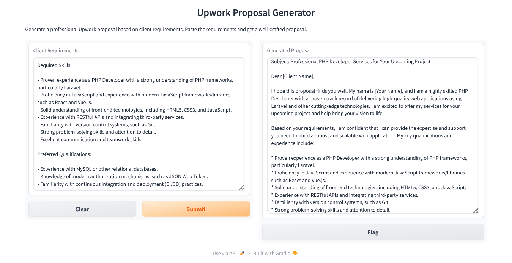

# job-hunters-assistant
A smart app that helps you find and get jobs. It improves resumes, writes cover letters, and gives career advice. Built with Llama-2-70-b-chat, IBM's watson x.ai, and Gradio using Python.

# Screenshot

